# 🏥 Unified Health Alliance (UHA) — Digital Healthcare Operating Ecosystem

> *An enterprise-grade, multi-stakeholder digital healthcare ecosystem engineered with Flutter, Riverpod, and Supabase to unify Patients, Physicians, Pharmacies, Diagnostic Laboratories, and Hospital Administration into an integrated, real-time clinical network with AI-assisted symptom triage and longitudinal health records.*

---

[](https://flutter.dev)
[](https://dart.dev)
[](https://riverpod.dev)
[](https://supabase.com)
[](https://apple.com)
[](https://developeracademy.id)

---

## 📋 Apple Developer Academy Indonesia Portfolio Specification

### 1. One- to Two-Sentence Summary
**Unified Health Alliance (UHA)** is an interconnected digital healthcare ecosystem built with Flutter, Riverpod, and Supabase that breaks down clinical data silos by seamlessly linking patients, verified physicians, pharmacies, diagnostic laboratories, and hospital administrations into a real-time, privacy-first care delivery network. Featuring an on-device conversational AI symptom triage engine, digital e-prescription pad, synchronized pharmacy fulfillment queue, and longitudinal 360° Electronic Health Records, UHA replaces fragmented medical workflows with a unified, transparent standard of patient care.

### 2. Project Classification
- **Type**: Self-Initiated Project (Digital Healthcare Infrastructure & Distributed Clinical Systems)
- **Nature**: Individual Project (System Architecture, UI/UX Design System, Frontend Engineering, & Cloud Database Modeling)
- **Role**: Lead Systems Architect & Full-Stack Flutter Engineer
- **Core Disciplines**: Cross-Platform Mobile Engineering (Flutter/Dart), Reactive State Architecture (Riverpod), Backend-as-a-Service & Relational Database Design (Supabase/PostgreSQL/RLS), Conversational AI/ML Medical Triage, Clinical Informatics & Patient Safety (Drug Allergy Contraindication Alerts, Digital Prescriptions), and Human-Centered Healthcare UI/UX.

### 3. Impact Made on the Project
- **Eliminated Healthcare Information Silos**: Successfully unified 5 traditionally disconnected healthcare stakeholders (Patients, Doctors, Retail Pharmacies, Diagnostic Labs, and Hospital Administrators) within a single secure, role-delineated ecosystem.
- **AI-Powered Clinical Intake & Triage**: Designed an intuitive conversational AI symptom triage module that collects patient vitals and symptomatic history, delivers preliminary risk analyses, and intelligently suggests appropriate medical specializations to decrease diagnostic delays.
- **Critical Patient Safety Guardrails**: Built an active contraindication verification engine into both the physician's E-Rx pad and the pharmacy order fulfillment terminal, flagging severe cross-sensitivities (e.g., Penicillin allergies) before medicine can be dispensed.
- **Closed-Loop Pharmacy & Lab Logistics**: Engineered an end-to-end dispensing pipeline (Prescription Created → Pharmacy Live Order Queue → Barcode Pick & Pack → Inventory Decrement) alongside a real-time lab test request queue with verified, cryptographically signed digital report uploads.
- **Empowering Patient Agency with 360° EHR**: Replaced physical paperwork with an encrypted 360° digital health summary and an interactive chronological visual health timeline tracking consultations, lab test trends, and emergency medical history.
- **Enterprise-Grade Role Security & Compliance**: Architected multi-step regulatory credentialing workflows for medical practitioners, pharmacies, and pathology centers, secured by PostgreSQL Row Level Security (RLS) policies and automated trigger-based profile provisioning.

### 4. Key Learnings & Growth
- **Complex Relational Data Modeling & Security**: Deepened mastery of PostgreSQL schema normalization, foreign-key cascade behaviors, and fine-grained Row Level Security (RLS) policies in Supabase to enforce strict patient confidentiality and HIPAA-aligned data isolation.
- **Predictable Reactive State Architecture**: Orchestrated global state transitions across 40+ dynamic user screens using Riverpod StateNotifiers and FutureProviders, effectively managing asynchronous network operations, live subscriptions, and cross-feature dependencies.
- **Human-Centered Interaction Design for High-Stress Contexts**: Developed the signature UHA Emerald & Dark Jade design language with custom glassmorphism, responsive typography, and tactile status indicators, prioritizing clarity and visual calm for both rushed healthcare providers and anxious patients.
- **Real-World Healthcare Workflow Engineering**: Learned to translate complex regulatory and institutional procedures—such as physician council license verification, NABL laboratory accreditation auditing, and drug batch inventory management—into streamlined digital flows.

---

## 🌟 Apple Developer Academy Evaluation Pillars

| Academy Value | How Unified Health Alliance (UHA) Demonstrates It |
| :--- | :--- |
| **🔥 Interest & Motivation** | Born out of a deep personal passion to resolve real-world healthcare fragmentation, dedicating hundreds of hours to architecting an ambitious 5-stakeholder ecosystem spanning mobile frontends, reactive state management, and real-time cloud databases. |
| **🎨 Creativity & Expression** | Crafted a bespoke, human-centered UI/UX experience featuring soothing medical emerald palettes, high-contrast dark modes, interactive chronological health timelines, and animated triage telemetry cards that elevate clinical software into an inspiring digital product. |
| **🧠 Interdisciplinary Potential** | Harmonized healthcare regulatory standards, clinical pharmacology safety principles, conversational AI diagnostic modeling, and full-stack software engineering with clean cross-platform mobile design. |
| **⚡ Work Ethic & Excellence** | Delivered a complete, end-to-end functioning prototype encompassing 43 meticulously designed screens, robust Supabase backend schemas, automated database triggers, authentication gateways, and full routing coverage. |

---

## 📸 Comprehensive Visual Architecture & Screen Walkthrough (43 Screens)

The following 43 screens showcase the complete end-to-end journey across all five healthcare stakeholders, extracted directly from the system assets.

```
Unified Health Alliance (UHA)
│
├── 🎨 Module 1: Brand Design System & Multi-Role Onboarding Gateway (7 Screens)
├── 🩺 Module 2: Patient Experience, AI Triage & Longitudinal Care (10 Screens)
├── 👨‍⚕️ Module 3: Physician Clinical Suite & Smart Telehealth (6 Screens)
├── 💊 Module 4: Pharmacy Operations & Pharmaceutical Logistics (9 Screens)
├── 🔬 Module 5: Diagnostic Laboratory & Pathology Pipeline (6 Screens)
└── 🏥 Module 6: Hospital Administration & Enterprise Governance (5 Screens)
```

---

### 🎨 Module 1: Brand Design System & Multi-Role Gateway

*The entryway into the UHA ecosystem establishes trust through a refined medical visual language, biometric security, and dedicated role onboarding gateways.*

| **01. Brand Splash Screen** | **02. Brand Design Tokens** | **03. Universal Login Portal** |
| :---: | :---: | :---: |
|  | 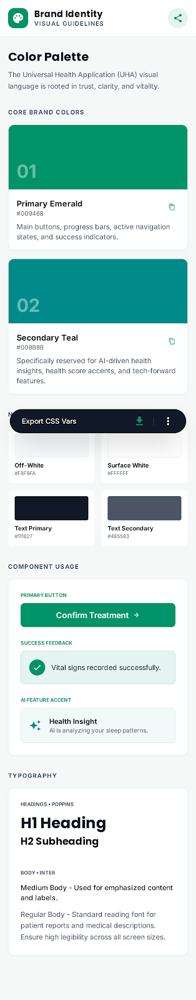 | 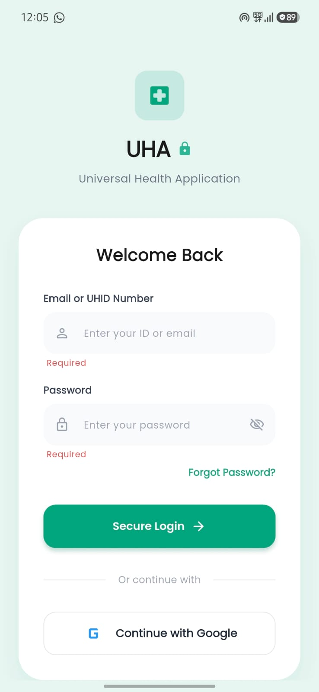 |
| *Minimalist emerald medical emblem & animated gateway entrance* | *Design system token catalog & semantic color tokens* | *Role-based login with biometric Face ID support* |

| **04. Unified Role Selector** | **05. Verification Under Review** | **06. Registration Success** |
| :---: | :---: | :---: |
| 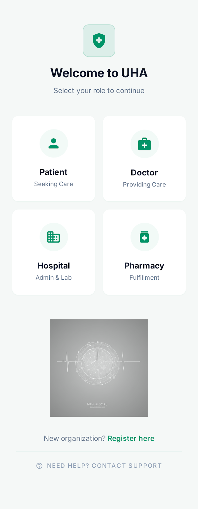 | 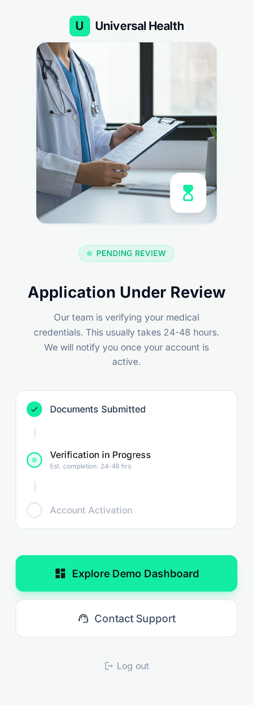 | 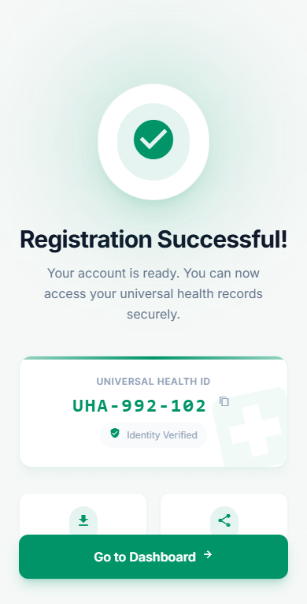 |
| *Interactive selector optimizing cross-functional access* | *Regulatory review status with live audit tracker* | *Emerald celebratory screen issuing digital biometric pass* |

---

### 🩺 Module 2: Patient Experience, AI Triage & Longitudinal Care

*A patient-centric command center combining proactive health monitoring, AI-assisted symptom triage, electronic medical records, and physician booking.*

| **08. Patient Demographics** | **09. Biometric Security Setup** | **10. Identity & Insurance** |
| :---: | :---: | :---: |
| 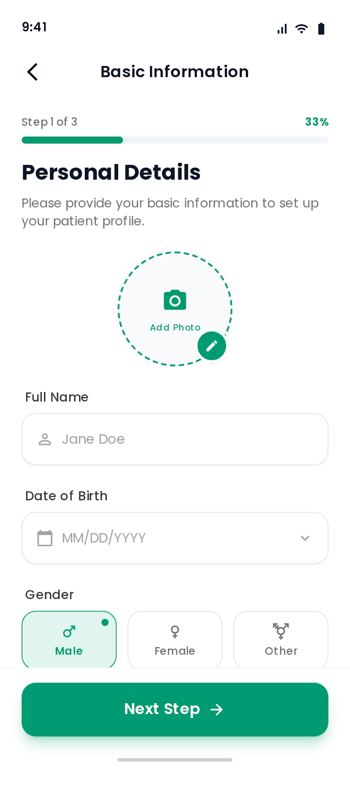 | 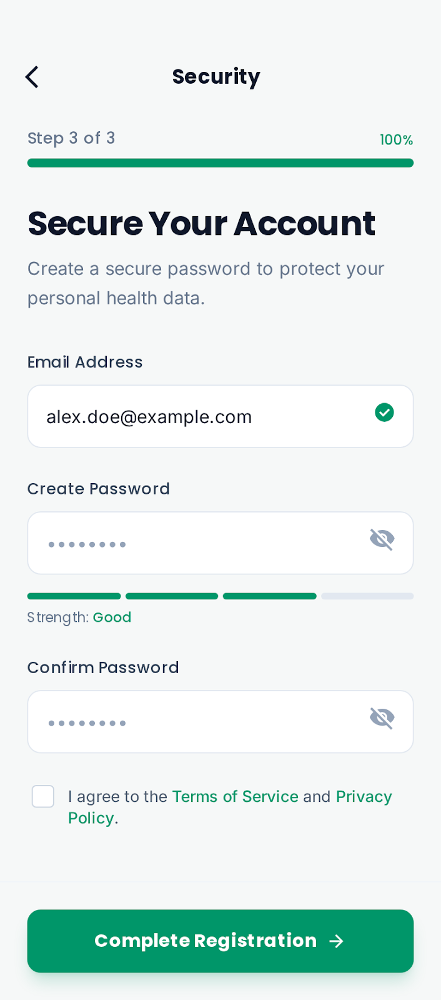 | 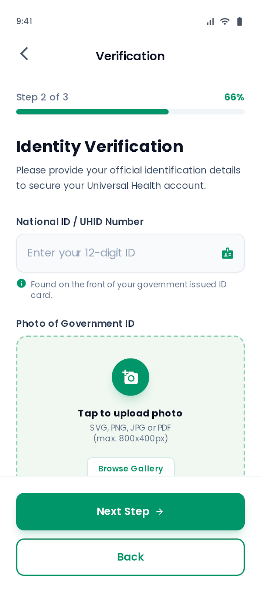 |
| *Patient demographic profile setup & data validation* | *Biometric Face ID & 6-digit PIN configuration* | *2FA mobile OTP & insurance policy binding* |

| **11. Patient Daily Home Hub** | **12. Health & Vitals Dashboard** | **13. Conversational AI Triage** |
| :---: | :---: | :---: |
| 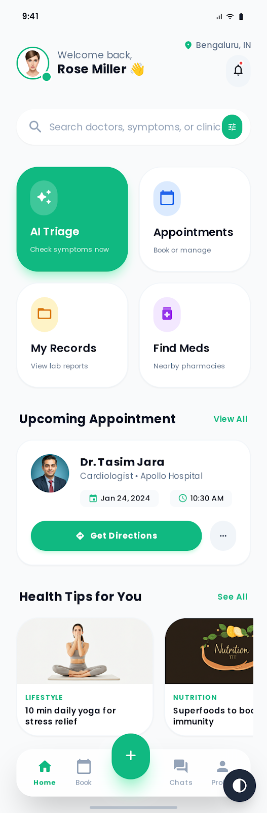 | 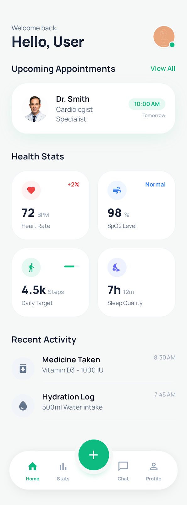 |  |
| *Daily overview hub with emergency SOS trigger* | *Holistic biometric telemetry & health index score* | *AI clinical triage with specialist routing* |

| **14. 360° Digital Health Record** | **15. Chronological Health Journey** | **16. Specialist Search & Discovery** |
| :---: | :---: | :---: |
| 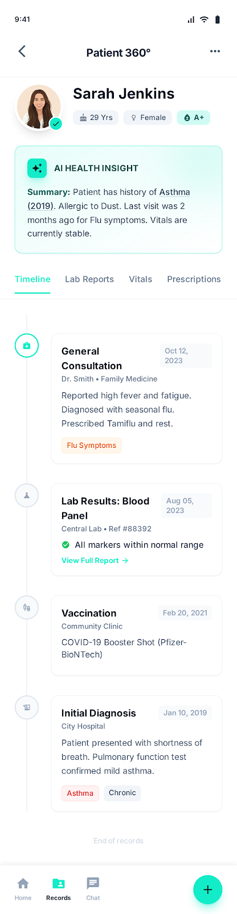 |  | 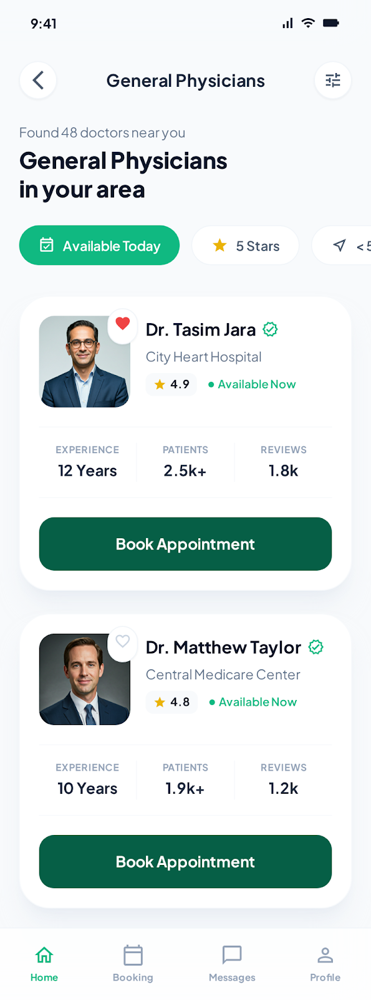 |
| *Consolidated longitudinal EHR accessible by doctors* | *Interactive visual timeline charting medical milestones* | *Physician directory filtered by specialty & proximity* |

| **17. Appointment Booking & Checkout** | | |
| :---: | :---: | :---: |
| 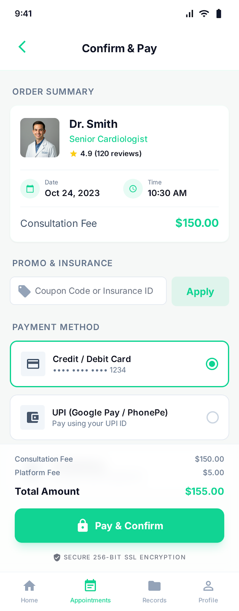 | | |
| *Consultation fee breakdown & multi-channel payment* | | |

---

### 👨‍⚕️ Module 3: Physician Clinical Suite & Smart Telehealth

*A comprehensive workspace empowering medical practitioners to manage patient appointments, hospital shift rosters, and issue verifiable digital prescriptions with built-in safety alerts.*

| **18. Professional Profile** | **19. Council License Upload** | **20. Clinical Security Setup** |
| :---: | :---: | :---: |
| 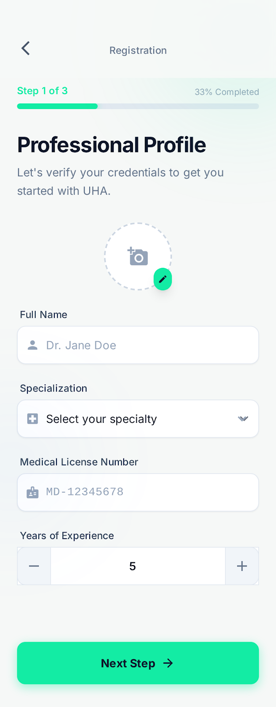 | 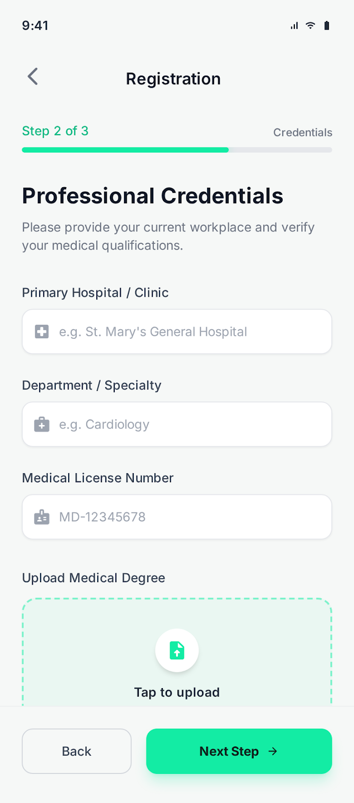 | 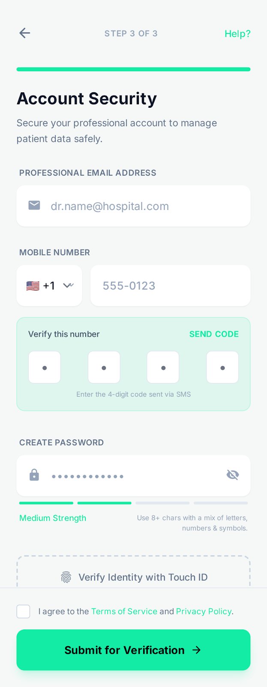 |
| *Medical council registration & clinical specialization* | *Medical degree certificate upload & verification* | *Physician session encryption & 2FA security* |

| **21. Daily Consultation Schedule** | **22. Multi-Hospital Shift Roster** | **23. E-Rx Pad & Allergy Alerts** |
| :---: | :---: | :---: |
|  | 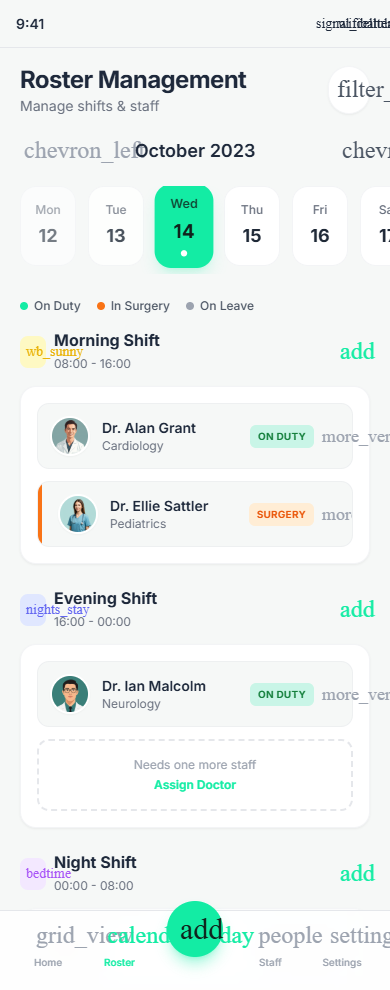 |  |
| *Daily patient queue planner & consultation triggers* | *Cross-hospital on-call scheduling & availability* | *Prescription generator with Penicillin allergy alert* |

---

### 💊 Module 4: Pharmacy Operations & Pharmaceutical Logistics

*A digital pharmacy management suite enabling drug inventory monitoring, incoming prescription queue handling, patient allergy verification, and settlement payouts.*

| **24. Retail Pharmacy Profile** | **25. Drug License Upload** | **26. Bank & Payout Setup** |
| :---: | :---: | :---: |
| 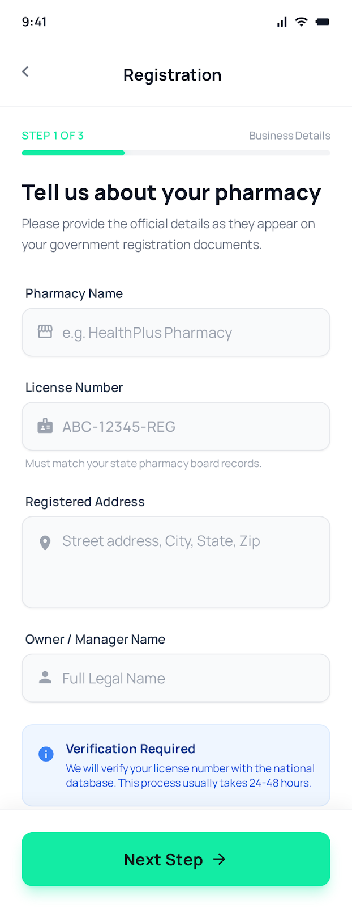 | 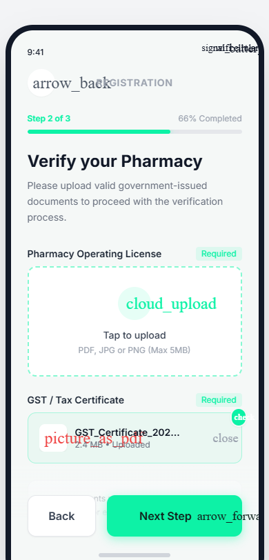 | 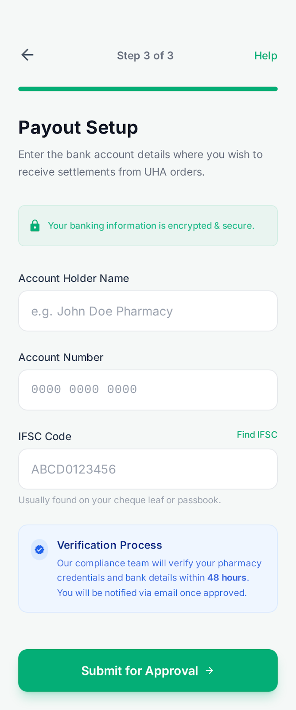 |
| *Commercial registration & operating hours setup* | *Pharmacist certification & retail permit validation* | *Commercial bank account linkage for payouts* |

| **27. Regulatory Compliance Status** | **28. Live Prescription Queue** | **29. Fulfillment & Allergy Safety** |
| :---: | :---: | :---: |
| 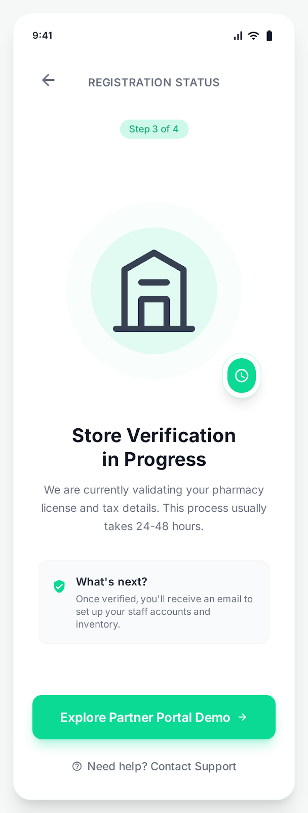 | 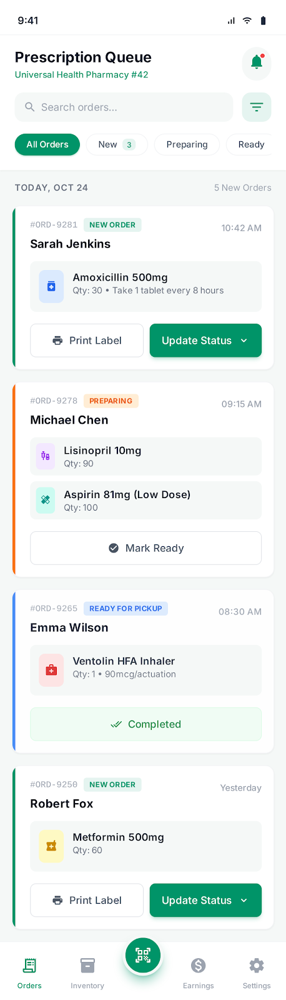 |  |
| *State pharmaceutical board license audit status* | *Incoming e-prescription queue prioritized by urgency* | *Pick & pack console with severe allergy warnings* |

| **30. Smart Drug Inventory Control** | **31. Sales Performance & Volume** | **32. Daily Settlements & Escrow** |
| :---: | :---: | :---: |
| 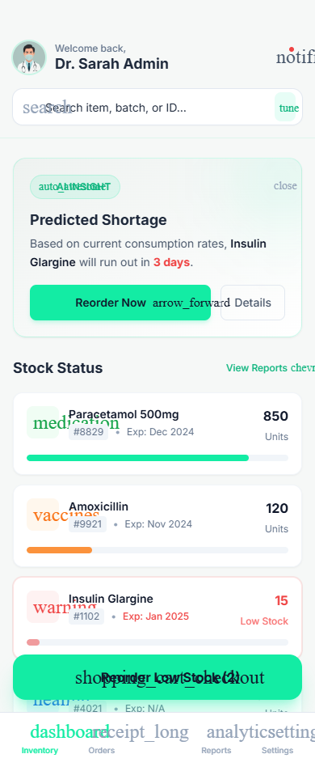 | 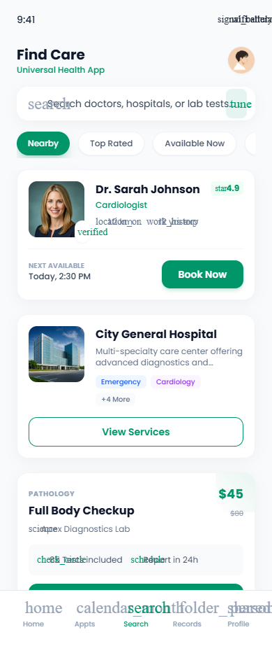 | 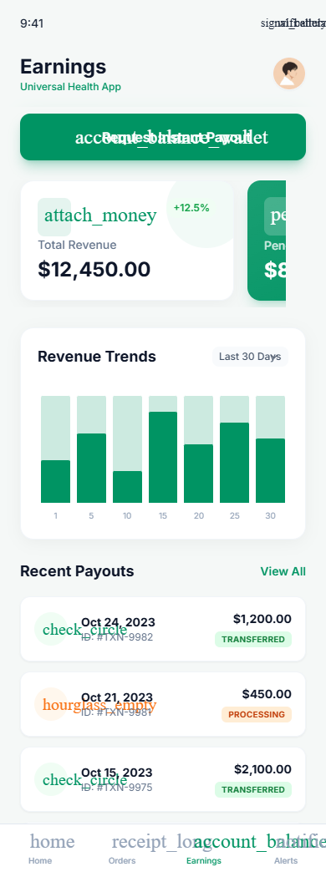 |
| *Stock monitoring, batch expiries & low-stock triggers* | *Fulfillment metrics, sales volume & category analytics* | *Gross revenue, net margins & bank settlements* |

---

### 🔬 Module 5: Diagnostic Laboratory Management & Pathology Pipeline

*A specialized diagnostic diagnostic workflow connecting test requisitions from doctors with phlebotomy sample tracking, test verification, and automated patient report delivery.*

| **33. Diagnostic Facility Profile** | **34. NABL & ISO Certifications** | **35. Institutional Billing Setup** |
| :---: | :---: | :---: |
| 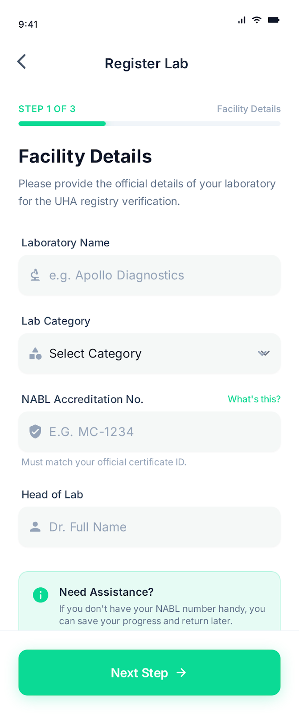 | 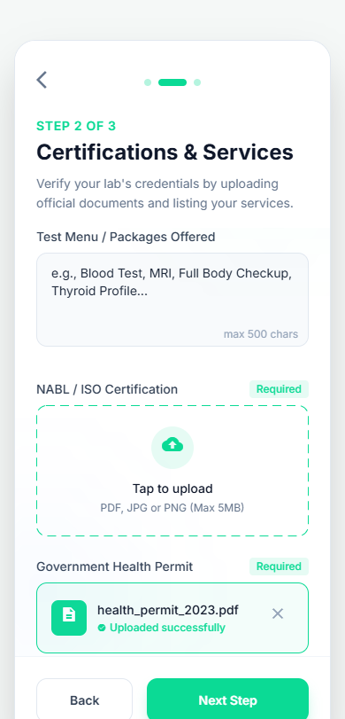 | 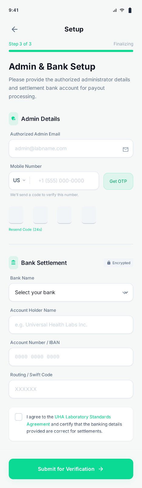 |
| *Pathology specialty profile & test menu catalog* | *NABL accreditations & ISO 15189 compliance* | *Institutional payment gateway & merchant setup* |

| **36. Clinical Laboratory Approval** | **37. Test Requisition Queue** | **38. Verified Result Upload Console** |
| :---: | :---: | :---: |
| 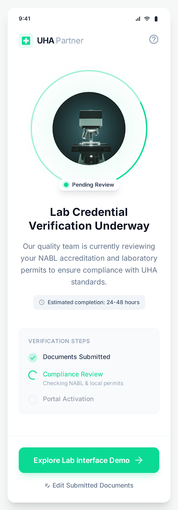 | 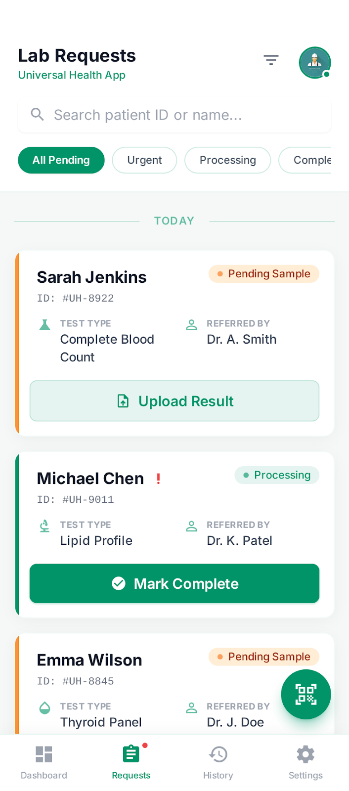 | 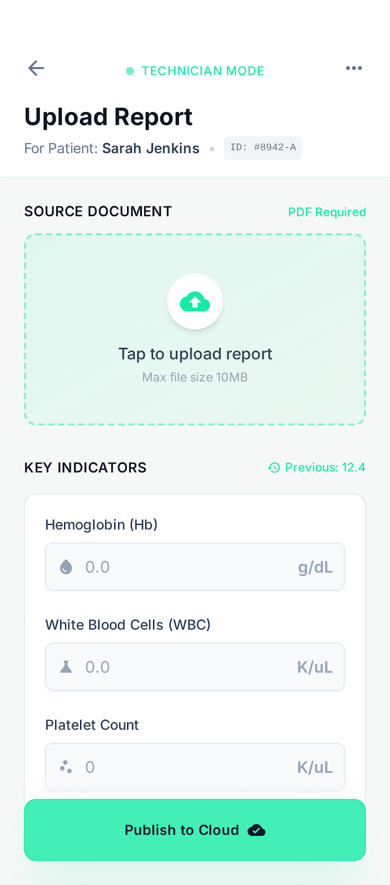 |
| *Clinical inspection approval & compliance tracking* | *Incoming diagnostic test orders with sample IDs* | *Pathology report generator with instant patient sync* |

---

### 🏥 Module 6: Hospital Administration & Enterprise Governance

*High-level institutional administration providing multi-department oversight, bed occupancy metrics, staff rosters, and clinical governance.*

| **39. Institutional Profile** | **40. ICU & Ward Infrastructure** | **41. Administrative Governance** |
| :---: | :---: | :---: |
| 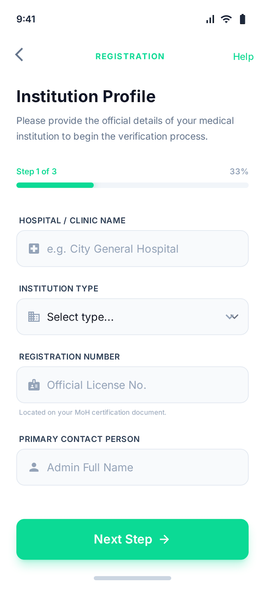 | 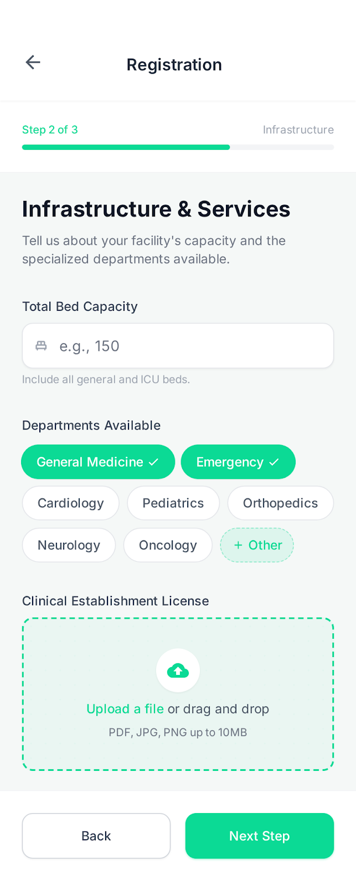 | 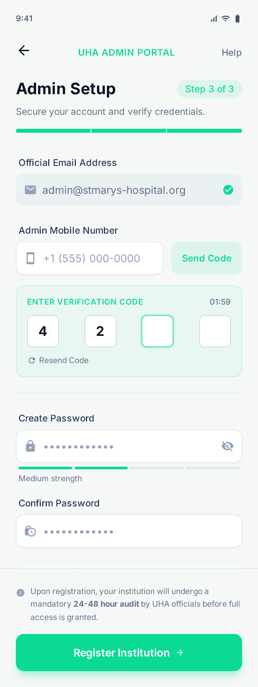 |
| *Healthcare institution setup & trauma capabilities* | *ICU beds, emergency bays & specialized wards* | *Chief Medical Officer & department head roles* |

| **42. Hospital Accreditation Tracker** | **43. Master Operations Overview** | |
| :---: | :---: | :---: |
| 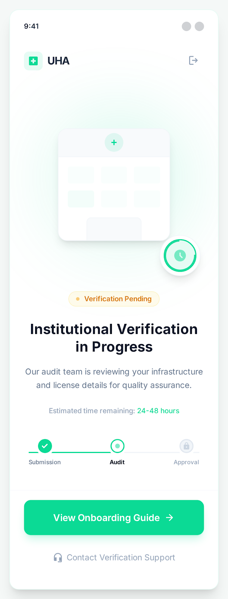 |  | |
| *Health department registration & audit clearance* | *Live bed occupancy, emergency intake & roster KPIs* | |

---

## 🏗️ System Architecture & Data Orchestration

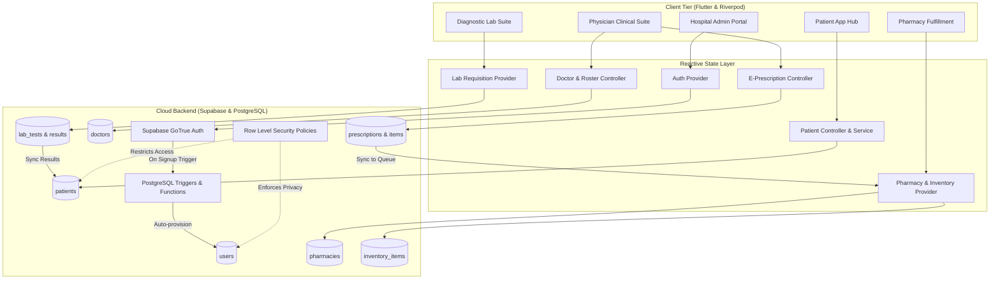
```mermaid
graph TB
    subgraph Clients["Client Tier (Flutter & Riverpod)"]
        P[Patient App Hub]
        D[Physician Clinical Suite]
        Ph[Pharmacy Fulfillment]
        L[Diagnostic Lab Suite]
        H[Hospital Admin Portal]
    end

    subgraph State["Reactive State Layer"]
        R_Auth[Auth Provider]
        R_Patient[Patient Controller & Service]
        R_Doctor[Doctor & Roster Controller]
        R_Rx[E-Prescription Controller]
        R_Pharm[Pharmacy & Inventory Provider]
        R_Lab[Lab Requisition Provider]
    end

    subgraph Backend["Cloud Backend (Supabase & PostgreSQL)"]
        Auth[Supabase GoTrue Auth]
        DB_Users[(users)]
        DB_Patients[(patients)]
        DB_Doctors[(doctors)]
        DB_Pharm[(pharmacies)]
        DB_Rx[(prescriptions & items)]
        DB_Lab[(lab_tests & results)]
        DB_Inv[(inventory_items)]
        Triggers[PostgreSQL Triggers & Functions]
        RLS[Row Level Security Policies]
    end

    P --> R_Patient
    D --> R_Doctor
    D --> R_Rx
    Ph --> R_Pharm
    L --> R_Lab
    H --> R_Auth

    R_Auth --> Auth
    R_Patient --> DB_Patients
    R_Doctor --> DB_Doctors
    R_Rx --> DB_Rx
    R_Pharm --> DB_Pharm
    R_Pharm --> DB_Inv
    R_Lab --> DB_Lab

    Auth -->|On Signup Trigger| Triggers
    Triggers -->|Auto-provision| DB_Users
    DB_Rx -->|Sync to Queue| R_Pharm
    DB_Lab -->|Sync Results| DB_Patients
    RLS -.->|Enforces Privacy| DB_Users
    RLS -.->|Restricts Access| DB_Patients
```

### Key Architectural Highlights
1. **Event-Driven Database Triggers**: When a user registers through Supabase Auth, a PostgreSQL trigger automatically initializes their core profile in the `users` table with their selected role, ensuring data consistency with zero orphaned auth records.
2. **Strict Row-Level Security (RLS)**: Sensitive patient medical information and prescription data are strictly isolated via PostgreSQL RLS policies; patients can only view their own records, and clinicians can only access records during active consultation sessions.
3. **Decoupled Service-Repository Pattern**: Clean separation of UI views, Riverpod controllers, domain services, and database repositories prevents spaghetti code and facilitates testability.
4. **Resilient Offline-First Data Strategy**: Local session caching paired with optimistic UI updates ensures clinicians and patients experience snappy response times even in low-bandwidth environments.

---

## 🛠️ Technology Stack & Dependencies

- **Cross-Platform Framework**: [Flutter](https://flutter.dev) (v3.11+) / [Dart](https://dart.dev) (v3.0+)
- **State Management**: [Riverpod](https://riverpod.dev) (`flutter_riverpod: ^3.2.1`)
- **Backend & Database**: [Supabase](https://supabase.com) (`supabase_flutter: ^2.12.0`) & PostgreSQL
- **Routing & Navigation**: [Routemaster](https://pub.dev/packages/routemaster) (`routemaster: ^1.1.0`)
- **Authentication**: Supabase Auth & Google Sign-In (`google_sign_in: ^7.2.0`)
- **Typography & Icons**: Google Fonts (`google_fonts: ^6.1.0`), Cupertino Icons (`cupertino_icons: ^1.0.8`), Material Round Icons
- **Design Tokens**: Emerald Medical Palette, Inter & Poppins typography, Glassmorphism backdrop filters
- **Utilities**: `flutter_dotenv`, `intl`, `fpdart`, `image_picker`, `file_picker`, `url_launcher`, `uuid`

---

## 🚀 Quick Start & Local Setup

### Prerequisites
- [Flutter SDK](https://docs.flutter.dev/get-started/install) (v3.11 or later)
- Android Studio / Xcode / VS Code
- A free [Supabase](https://supabase.com) project

### 1. Clone & Install Dependencies
```powershell
git clone https://github.com/yashmanjunath-74/UHA.git
cd UHA
flutter pub get
```

### 2. Configure Supabase Database
1. Open your Supabase Dashboard → **SQL Editor**.
2. Run the SQL schema scripts provided in the repository:
   - `SQL_QUERIES_COPY_PASTE.md` (Core `users` and `patients` schema with auto-triggers)
   - `supabase_doctor_pharmacy_lab_schema.sql` (Doctor, Pharmacy, and Lab tables)
   - `supabase_patient_features_schema.sql` (Prescriptions and Lab results tables)
3. Ensure **Email/Password** authentication is enabled under **Authentication → Providers**.

### 3. Setup Environment Variables
Create or update the `.env` file in the project root:
```env
SUPABASE_URL=https://your-project-ref.supabase.co
SUPABASE_ANON_KEY=your-supabase-anon-key-here
```

### 4. Run the Application
```powershell
flutter run
```

---

## 📬 Portfolio Submission Details

- **Candidate**: Yashwanth M (`yashmanjunath-74`)
- **Target Institution**: Apple Developer Academy Indonesia
- **Project Role**: System Architect & Full-Stack Flutter Engineer
- **Official Submission Document**: `Yashwanth_Portfolio_Academy.pdf`
- **Portfolio Repository**: [github.com/yashmanjunath-74/UHA](https://github.com/yashmanjunath-74/UHA)

---

*Unified Health Alliance — Pioneering accessible, interconnected, and patient-first healthcare technology.*