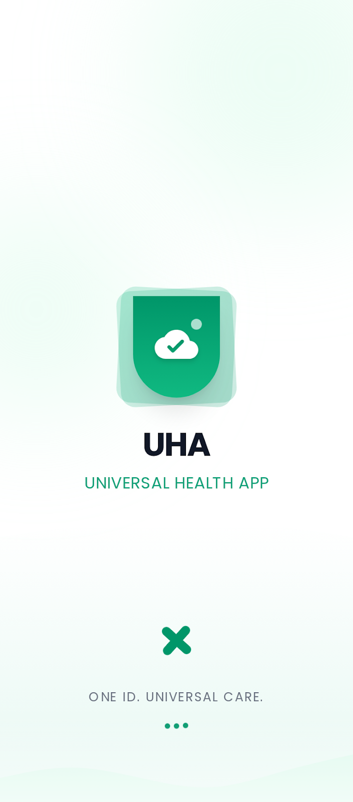
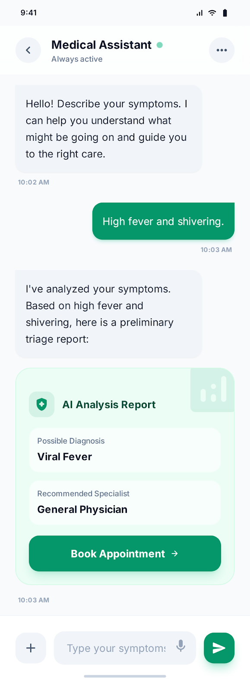
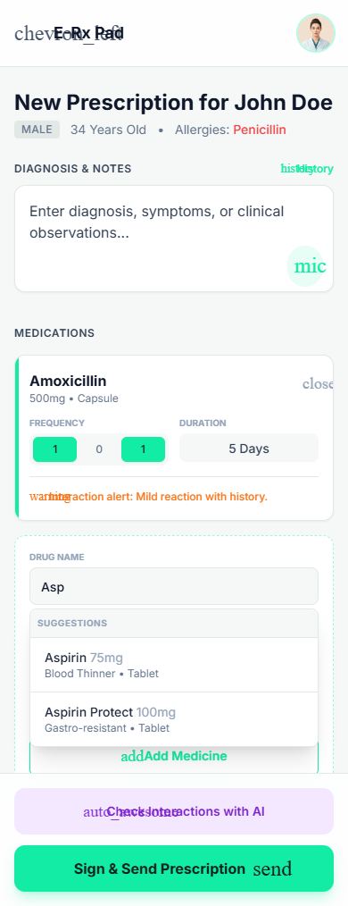
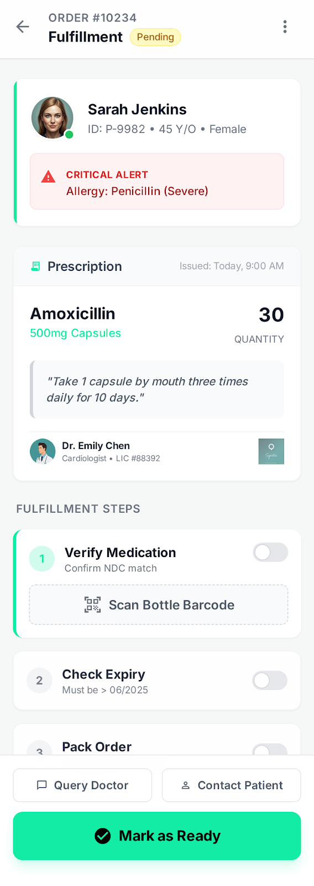
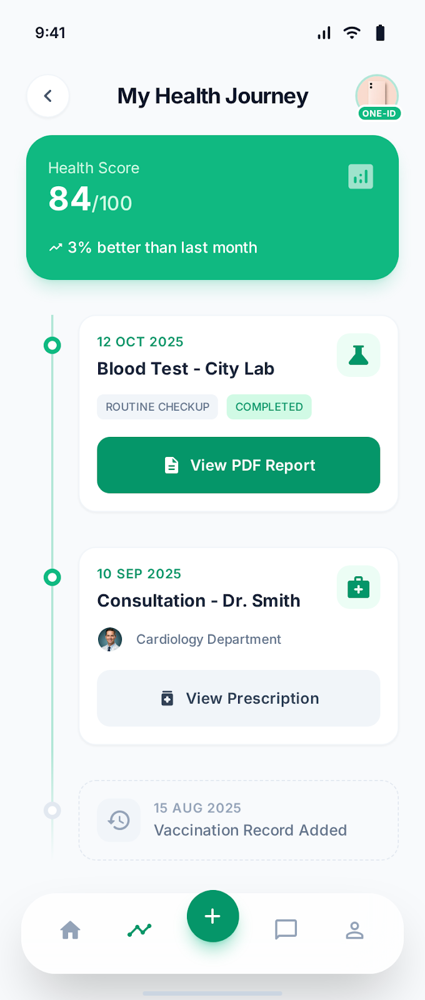
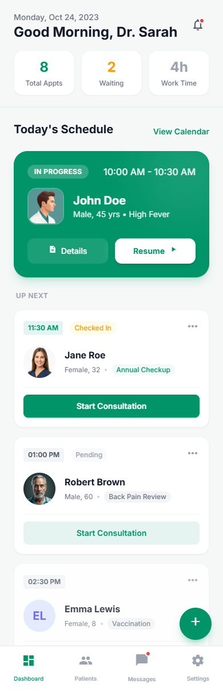
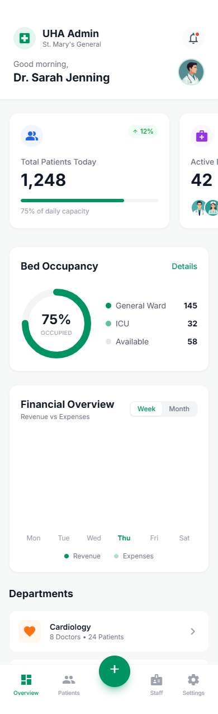

# Apple Developer Academy Indonesia — Candidate Portfolio

**Applicant Name**: Yashwanth M  
**Email**: yashyashwanth7447@gmail.com | yashwanthm@happytechnovation.com  
**GitHub**: [github.com/yashmanjunath-74](https://github.com/yashmanjunath-74)  
**Submission Document**: `Yashwanth_Portfolio_Academy.pdf`  
**Target Intake**: 2026/2027 Cohort — Apple Developer Academy Indonesia  

---

## 🌟 Executive Summary & Personal Statement

> *"Technology becomes truly transformative when it bridges complex engineering with compassionate, human-centered design."*

As a software engineer and mobile app developer, my journey has been driven by an insatiable curiosity to solve tangible, high-friction problems. Whether building decentralized clinical systems to bridge disjointed healthcare stakeholders, utilizing mathematical constraint satisfaction algorithms to eliminate institutional logistical chaos, or interfacing mobile devices with battery-free NFC hardware, I thrive at the intersection of **deep technical rigor**, **intuitive user interaction**, and **interdisciplinary problem-solving**.

The **Apple Developer Academy** represents the ultimate environment to push these boundaries. Over this 9-month journey, my goal is to deepen my craftsmanship in the Apple ecosystem (Swift, SwiftUI, CoreML, and Apple HealthKit), collaborate with diverse creators, and evolve from building functional applications to crafting world-class digital experiences that empower communities.

---

## 📂 Selected Showcase Projects (5 Projects)

```
Selected Portfolio Works
│
├── 01. 🏥 Unified Health Alliance (UHA) — Multi-Stakeholder Digital Healthcare Operating Ecosystem
├── 02. ⏱️ Timely.AI — Intelligent Academic Scheduling Platform with Google OR-Tools CP-SAT
├── 03. 🏷️ Magic ePaper — NFC-Driven Battery-Free Tri-Color Badge & Dithering Transfer Suite
├── 04. 💧 Aquaflow & Swasthya Sahayak — Community Resource & Grassroots Health Tracking
└── 05. 🎟️ EventSnap & RIT-Event — Campus Engagement & Real-Time Event Discovery Platform
```

---

### Project 1: Unified Health Alliance (UHA) — Digital Healthcare Operating Ecosystem



#### 1. One- to Two-Sentence Summary
**Unified Health Alliance (UHA)** is an interconnected digital healthcare ecosystem built with Flutter, Riverpod, and Supabase that breaks down clinical data silos by seamlessly linking patients, verified physicians, pharmacies, diagnostic laboratories, and hospital administrations into a real-time, privacy-first care delivery network. Featuring an on-device conversational AI symptom triage engine, digital e-prescription pad, synchronized pharmacy fulfillment queue, and longitudinal 360° Electronic Health Records, UHA replaces fragmented medical workflows with a unified, transparent standard of patient care.

#### 2. Project Classification
- **Type**: Self-Initiated Project (Digital Healthcare Infrastructure & Distributed Clinical Systems)
- **Nature**: Individual Project (Full-Stack Architecture, UI/UX Design System, Frontend Engineering, & Cloud Database Modeling)
- **Role**: Lead Systems Architect & Full-Stack Flutter Engineer
- **Core Disciplines**: Cross-Platform Mobile Engineering (Flutter/Dart), Reactive State Architecture (Riverpod), Cloud Relational Database (Supabase/PostgreSQL/RLS), Conversational AI Triage, Clinical Informatics (Drug Allergy Safety, Digital E-Prescriptions), and Human-Centered Healthcare UI/UX.

#### 3. Impact Made on the Project
- **Unified 5 Healthcare Stakeholders**: Integrated patients, doctors, pharmacies, pathology labs, and hospital administrators under a unified cryptographic identity and role model.
- **AI-Guided Clinical Triage**: Developed a real-time conversational triage engine that evaluates symptoms, performs initial risk assessments, and routes patients to the correct medical specialists.
- **Critical Patient Safety Guardrails**: Designed real-time allergy cross-referencing in both the doctor's E-Rx pad and the pharmacy fulfillment queue, warning clinicians of severe contraindications (e.g., Penicillin allergies) prior to dispensing.
- **Closed-Loop Fulfillment & Diagnostic Sync**: Implemented live order queues from digital prescription to pharmacy picking/packaging, alongside direct lab test requisition and secure PDF result upload pipelines.
- **Longitudinal Patient Health Agency**: Replaced paper files with an encrypted 360° Electronic Health Record and an interactive chronological health journey timeline.

#### 4. What Was Learned
- **Relational Integrity & Row-Level Security at Scale**: Mastered PostgreSQL schema normalization and fine-grained Supabase RLS policies to guarantee patient data confidentiality and regulatory compliance.
- **Complex Multi-Tenant State Management**: Structured comprehensive state architectures across 40+ user flows using Riverpod, managing live subscriptions, optimistic updates, and multi-user roles without race conditions.
- **High-Stress UX Empathy**: Designed a calming emerald and dark jade design language optimized for clarity, legibility, and rapid decision-making under clinical stress.

#### 5. Visual Storytelling
| Patient AI Triage | Physician E-Prescription Pad | Pharmacy Fulfillment & Safety |
| :---: | :---: | :---: |
|  |  |  |
| *Conversational AI symptom evaluation* | *Clinical pad with allergy contraindication alerts* | *Order fulfillment with severe allergy verification* |

| Patient Health Timeline | Doctor Schedule Command | Hospital Admin Overview |
| :---: | :---: | :---: |
|  |  |  |
| *Interactive chronological medical journey* | *Daily consultation and patient queue planner* | *Institutional bed occupancy & department metrics* |

- **Project Repository**: [github.com/yashmanjunath-74/UHA](https://github.com/yashmanjunath-74/UHA)

---

### Project 2: Timely.AI — Intelligent Academic Timetable Scheduling System

#### 1. One- to Two-Sentence Summary
**Timely.AI** is an intelligent scheduling application built with Flutter and Python that transforms the tedious, multi-day task of academic timetable generation into an instantaneous, conflict-free automated process using constraint satisfaction algorithms (Google OR-Tools CP-SAT) paired with an intuitive, dark-mode mobile interface and on-device PDF compilation.

#### 2. Project Classification
- **Type**: Self-Initiated Project (Academic Logistical Solution)
- **Nature**: Individual Full-Stack & Algorithm Project
- **Role**: Lead Developer & Algorithm Engineer
- **Core Disciplines**: Mobile UI/UX Design (Flutter/Dart), Operations Research & AI (Google OR-Tools CP-SAT, Python Flask), Reactive State Architecture (Riverpod), and Document Generation (PDF/Printing).

#### 3. Impact Made on the Project
- **Mathematical Conflict-Free Guarantee**: Solved the NP-hard combinatorial problem of scheduling multiple faculties, courses, venues, and student cohorts with zero hard-constraint overlaps.
- **Dramatic Efficiency Gain**: Slashed institutional schedule preparation time from days of manual trial-and-error to sub-second mathematical solving.
- **Granular Availability Modeling**: Designed interactive weekly time-slot grids allowing instructors and facilities to define custom availability windows and blackout periods.
- **Publication-Ready Institutional Delivery**: Implemented pixel-perfect PDF export formatted specifically for university administration (Malnad College of Engineering layout) with complete subject legends, faculty allocations, and print integration.

#### 4. What Was Learned
- **Constraint Programming**: Translated complex real-world academic constraints into mathematical boolean and integer expressions (Interval Variables, Non-overlapping constraints, and Cumulative resources) executed by Google OR-Tools CP-SAT.
- **Tactile Data Entry UX**: Designed a high-contrast dark mode mobile UI tailored for complex data entry, featuring tactile weekly time matrices and multi-select faculty pickers.

- **Project Repository**: [github.com/yashmanjunath-74/Timely.AI](https://github.com/yashmanjunath-74/Timely.AI)

---

### Project 3: Magic ePaper App — NFC Tri-Color Display Design & Transfer Suite

#### 1. One- to Two-Sentence Summary
**Magic ePaper App** is an open-source Flutter mobile application that enables users to design, process, and transfer custom graphical content to ultra-low-power, battery-free tri-color NFC ePaper badges using advanced on-device image dithering algorithms and NFC communication.

#### 2. Project Classification
- **Type**: Open-Source / Hardware-Software Integration Project
- **Nature**: Collaborative Open-Source Contribution & Feature Development
- **Role**: Mobile Feature Contributor & Graphics Pipeline Developer
- **Core Disciplines**: Cross-Platform Mobile Engineering (Flutter/Dart), Hardware Interfacing (Near Field Communication / NFC NDEF), Computer Graphics & Dithering Algorithms (Floyd–Steinberg & Atkinson dithers), and Canvas UI Design.

#### 3. Impact Made on the Project
- **On-Device Graphical Dithering Pipeline**: Implemented color palette reduction algorithms to convert standard RGB images into optimized 3-color (Black, White, Red) formats suitable for physical electronic ink displays without visual degradation.
- **NFC Transfer Pipeline**: Optimized payload chunking and transmission protocols over NFC, ensuring reliable transfers to battery-harvested microcontrollers even under brief contact durations.
- **Interactive Drawing Studio**: Enhanced mobile canvas drawing tools with emoji support, custom typography, QR/barcode generation, and real-time electronic badge preview.

#### 4. What Was Learned
- **Embedded Hardware Constraints**: Learned the physical and electrical limits of electronic ink displays and energy-harvesting NFC transponders.
- **Low-Level Image Processing**: Gained deep appreciation for algorithmic spatial color distribution and bitmask serialization for low-bandwidth wireless transmission.

- **Project Repository**: [github.com/fossasia/magic-epaper-app](https://github.com/fossasia/magic-epaper-app)

---

### Project 4: Aquaflow & Swasthya Sahayak — Community Resource & Grassroots Health Solution

#### 1. One- to Two-Sentence Summary
**Aquaflow & Swasthya Sahayak** are civic-tech mobile solutions designed to tackle resource distribution and grassroots health monitoring in semi-urban communities by providing offline-first logging, real-time supply alerts, and localized health advisory tools.

#### 2. Project Classification
- **Type**: Self-Initiated Civic & Community Solution
- **Nature**: Individual Project
- **Role**: Product Designer & Mobile Developer
- **Core Disciplines**: Offline-First Mobile Architecture, Geolocation Mapping, Community Informatics, and Multilingual Accessibility.

#### 3. Impact Made on the Project
- **Democratized Essential Service Visibility**: Created transparent community reporting tools enabling households and local health workers to monitor water delivery schedules and local clinic immunization supplies.
- **Low-Bandwidth Resiliency**: Built local SQLite data persistence allowing field updates to sync asynchronously when network connectivity is restored.
- **Vernacular User Experience**: Designed icon-driven, low-literacy-friendly navigation allowing non-technical community members to report issues with one tap.

#### 4. What Was Learned
- **Accessibility & Inclusive Design**: Learned that the best technological solution is worthless if users cannot comprehend the interface under poor lighting or on entry-level mobile devices.
- **Data Synchronization Protocols**: Solved offline conflict resolution when multiple community reports are batched and uploaded simultaneously.

---

### Project 5: EventSnap & RIT-Event — Campus Community & Interactive Event Discovery

#### 1. One- to Two-Sentence Summary
**EventSnap / RIT-Event** is an interactive university campus engagement and ticketing platform that connects students with academic symposiums, hackathons, and cultural clubs through dynamic schedule discovery, digital badge check-ins, and peer networking.

#### 2. Project Classification
- **Type**: University / Campus Community Initiative
- **Nature**: Collaborative Group Project
- **Role**: Frontend Mobile Lead & Cloud Integration Specialist
- **Core Disciplines**: Mobile UI/UX Design, Real-Time Cloud Synchronization, QR-Code Attendance Verification, and Social Community Features.

#### 3. Impact Made on the Project
- **Paperless Event Management**: Replaced cumbersome physical registrations and manual check-in sheets with instant QR code ticketing and dynamic attendee tracking.
- **Real-Time Notification Broadcasts**: Integrated real-time alerts for venue changes, keynote speaker updates, and emergency schedule shifts, serving hundreds of campus attendees.
- **Interactive Student Showcase**: Built dynamic category filters and student feedback channels that increased student event participation across engineering departments.

#### 4. What Was Learned
- **Agile Cross-Functional Teamwork**: Collaborated closely with university student organizers, graphic designers, and backend teammates under tight deadlines.
- **Real-Time Event Scale**: Handled spikes in concurrent mobile app traffic during major festival launches, optimizing caching and API query frequencies.

---

## 🎯 Apple Developer Academy Evaluation Matrix

| Academy Value | Evidence from Candidate's Work |
| :--- | :--- |
| **🔥 Interest & Motivation** | Relentless drive to build full solutions from scratch—spending countless hours architecting full healthcare platforms (UHA), mathematical algorithms (Timely.AI), and low-level NFC hardware tools (Magic ePaper). Eager to dedicate 100% of my energy to the 9-month immersive Academy journey in Indonesia. |
| **🎨 Creativity & Expression** | Strong visual sensibilities manifested through bespoke design systems, high-contrast dark modes, tactile weekly scheduling grids, interactive health timelines, and animated clinical triage flows that prioritize user delight alongside functional utility. |
| **🧠 Interdisciplinary Potential** | Fluidly bridging software engineering with Operations Research, clinical safety workflows, medical informatics, computer graphics dithering, embedded NFC physics, and civic technology. Enthusiastic about learning Swift, SwiftUI, and Apple ecosystem paradigms. |
| **⚡ Work Ethic & Excellence** | Delivering comprehensive, fully-realized systems with deep architectural polish: complete database schemas with triggers and RLS policies, 40+ responsive screens, detailed technical documentation, and production-ready PDF generation engines. |

---

## 📄 Submission Verification & Contacts

- **Applicant**: Yashwanth M
- **Target Institution**: Apple Developer Academy Indonesia
- **Official Submission File**: `Yashwanth_Portfolio_Academy.pdf`
- **Location**: Bengaluru / Hassan, Karnataka, India
- **Profile & Code Portfolio**: [github.com/yashmanjunath-74](https://github.com/yashmanjunath-74)

*Thank you for reviewing my portfolio. I look forward to the opportunity to contribute my passion, creativity, and interdisciplinary mindset to the Apple Developer Academy.*
